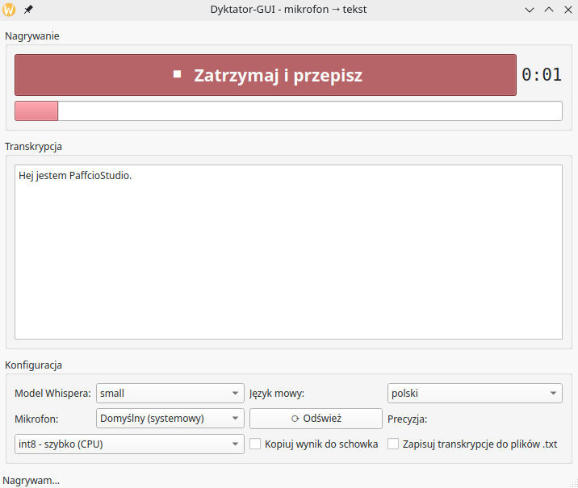

# Dyktator-GUI

Nagrywanie mowy z mikrofonu i **w pełni lokalna** transkrypcja (faster-whisper).
Jeden przycisk: klik → nagrywa, drugi klik → kończy i przepisuje tekst w oknie.



## Do czego się przydaje

- **Nauka wymowy i akcentu** - ustaw język na np. angielski, powiedz zdanie
  po angielsku i sprawdź, co „usłyszał" Whisper. Przepisał dokładnie to, co
  zamierzałeś? Wymowa siadła. Zniekształcił jakieś słowo? Masz od razu
  feedback, co wymaga poprawy. Działa tak z każdym językiem z listy -
  możesz treningowo przerabiać różne akcenty.
- **Budowa głosowego asystenta AI** - Dyktator-GUI to gotowy pierwszy etap
  takiego systemu: mowa → tekst. Dalej droga jest już krótka: tekst
  (np. ze schowka, przy włączonej opcji kopiowania) trafia do modelu
  językowego, model zwraca odpowiedź, a syntezator mowy (TTS) czyta ją
  na głos. Pełny obieg: **mowa → tekst → AI → tekst → mowa** - pole do
  popisu jest ogromne.
- **Zwykłe dyktowanie** - notatki, wiadomości, pierwszy szkic tekstu bez
  klepania na klawiaturze; wynik od razu w oknie (można poprawić) i
  opcjonalnie w schowku.

## Uruchomienie

```bash
./venv.sh   # jednorazowo: tworzy .venv/, instaluje zależności i pobiera model
./run.sh    # uruchamia aplikację
```

`venv.sh` jest idempotentny - można go odpalać wielokrotnie; pomija to, co
już zrobione. Model Whispera pobiera taki, jaki jest ustawiony w
`config.json` (domyślnie `small`) do cache `~/.cache/huggingface`.

## Jak to działa

- Nagrywanie odbywa się przez PipeWire (`pw-record`, format 48 kHz / 16-bit / stereo),
  więc aplikacja widzi wszystkie źródła dźwięku systemowego i podąża za
  domyślnym mikrofonem ustawionym w KDE.
- Nagrania trafiają do `nagrania/RRRR-MM-DD_GG-MM-SS.wav`.
- Transkrypcja działa na CPU (int8) modelem faster-whisper; pierwszy start
  wybranego modelu pobiera go z Hugging Face do `~/.cache/huggingface/`,
  potem działa bez internetu.

## Opcje konfiguracji (w GUI)

| Opcja | Znaczenie |
|---|---|
| Model Whispera | `tiny` → `large-v3`; większy = dokładniejszy, ale wolniejszy |
| Język mowy | wymuszenie języka (np. polski) poprawia dokładność |
| Mikrofon | dowolne źródło z PipeWire lub domyślne systemowe |
| Precyzja | `int8` (szybko) / `float32` (dokładniej) |
| Kopiuj do schowka | wynik automatycznie ląduje w schowku |
| Zapisuj transkrypcje | dodatkowy plik `.txt` w `zapisy/` |

Ustawienia zapisują się w `config.json` obok skryptu.

## Struktura

```
Dyktator-GUI/
├── main.py           # cała aplikacja (PyQt6)
├── run.sh            # launcher
├── venv.sh           # instalacja środowiska .venv/, zależności i modelu
├── requirements.txt
├── config.json       # tworzony przy pierwszym uruchomieniu
├── nagrania/         # pliki WAV z nagrań
└── zapisy/           # transkrypcje .txt (jeśli włączone)
```
